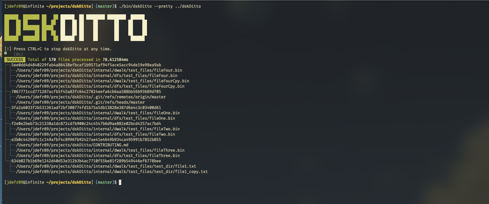
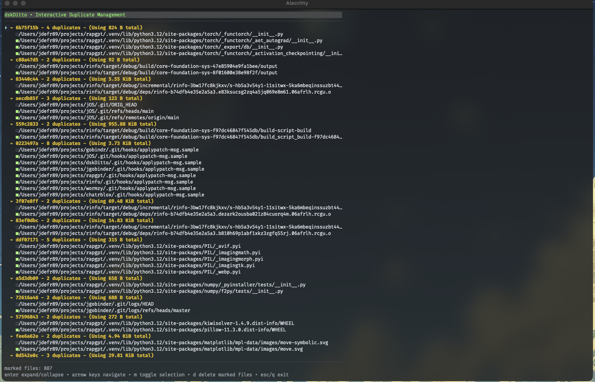
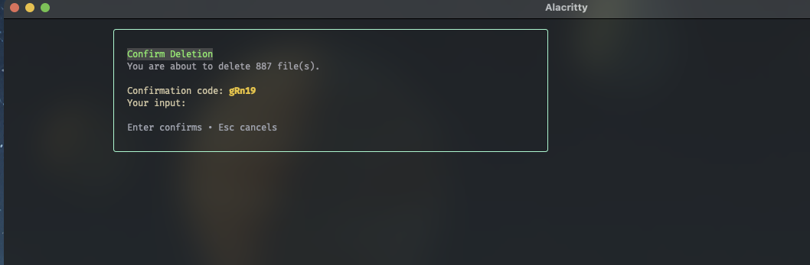
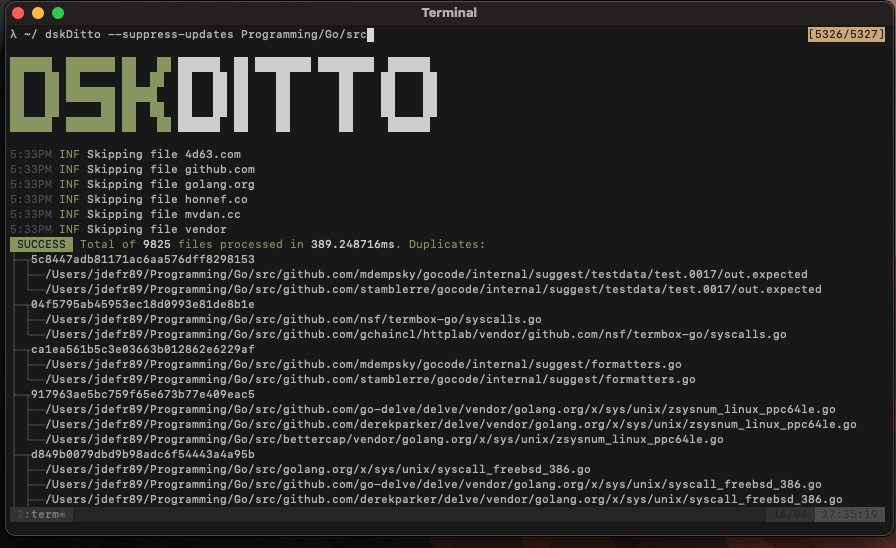
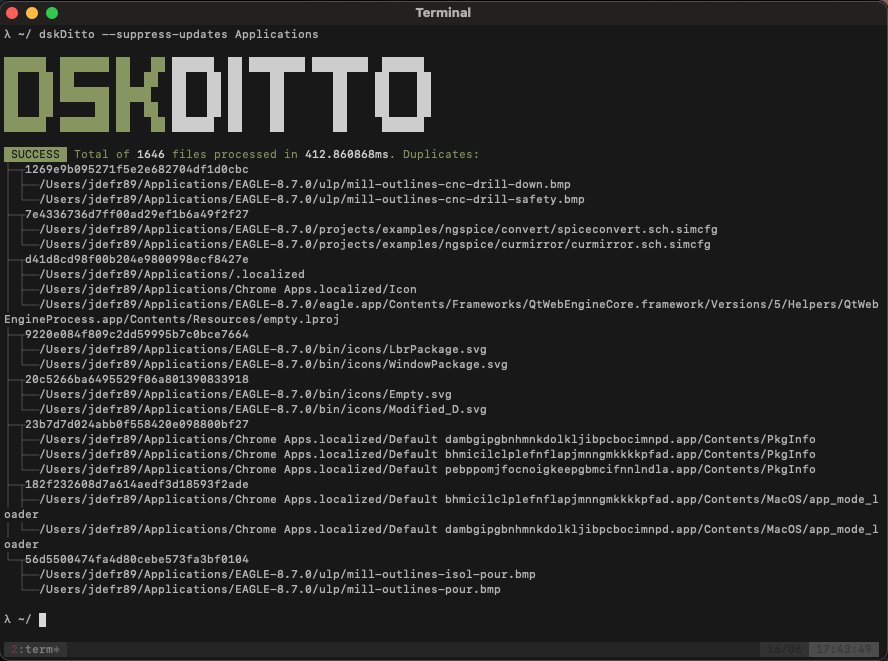

# dskDitto

[](https://pkg.go.dev/github.com/jdefrancesco/dskDitto)
[](https://goreportcard.com/report/github.com/jdefrancesco/dskDitto)


`dskDitto` is a fast, parallel duplicate-file detector with an optional interactive terminal UI that lets you review, keep, or safely delete redundant files.

## Features

- Concurrent directory walker tuned for large trees and multi-core systems
- Pluggable hashing with SHA-256 (default) or BLAKE3
- Pluggable hashing with SHA-256 (default) or BLAKE3
- Targeted mode to search for duplicates of a single file
- Multiple output modes: TUI, bullet lists, or text-friendly dumps
- CSV and JSON output supported via flags.
- Optional automated duplicate removal with confirmation safety rails
- Profiling toggles and micro-benchmarks for power users

## Install

Install straight from source using Go 1.22+:

```bash
go install github.com/jdefrancesco/dskDitto/cmd/dskDitto@latest
```

This drops the binary at `$(go env GOPATH)/bin/dskDitto` (or `~/go/bin` by default).

Prefer cloning? Build locally via Make:

```bash
git clone https://github.com/jdefrancesco/dskDitto
cd dskDitto
make          
```

The resulting binary lives in `bin/dskDitto`. Add it to your `$PATH` or run it from the repo root.

## Usage

```bash
dskDitto [options] PATH...
```

Common flags:

| Flag | Description |
| ---- | ----------- |
| `--min-size <bytes>` | Ignore files smaller than the provided size |
| `--max-size <bytes>` | Skip files larger than the provided size (default 4 GiB) |
| `--hidden` | Include dot files and dot-directories |
| `--no-symlinks` | Skip symbolic links |
| `--empty` | Include zero-byte files |
| `--include-vfs` | Include virtual filesystem directories such as `/proc` or `/dev` |
| `--no-recurse` | Restrict the scan to the provided paths only |
| `--depth <levels>` | Limit recursion to `<levels>` directories below the starting paths |
| `--text`, `--bullet` | Render duplicates without launching the TUI |
| `--remove <keep>` | Operate on duplicates, keeping the first `<keep>` entries per group |
| `--link` | With `--remove`, convert extra duplicates to symlinks instead of deleting them |
| `--file <path>` | Only report duplicates of the given file |
| `--hash <algo>` | Select hash algorithm: `sha256` (default) or `blake3` |

Press `Ctrl+C` at any time to abort a scan. When duplicates are removed or converted, a confirmation dialog prevents accidental mass changes.

### Duplicate removal and symlink conversion

`dskDitto` never deletes or rewrites anything unless you explicitly ask it to with `--remove`.

- **Dry / interactive modes:** by default (or with `--text` / `--bullet`) the tool only reports duplicates.
- **Delete extras:** use `--remove <keep>` to delete all but `<keep>` files in each duplicate group.
- **Convert extras to symlinks:** combine `--remove <keep> --link` to replace extra duplicates with symlinks pointing at one kept file per group.

On Unix-like systems, multiple hard links to the same underlying file are treated as a single entry during scanning: `dskDitto` hashes the content once and does not report those hard-link paths as separate space-wasting duplicates.

When using `--link`, the on-disk layout after the operation looks like this for a group of 3 identical files and `--remove 1 --link`:

```text
/path/to/keep/file.txt      # original file kept
/path/to/dup/file-copy.txt  -> /path/to/keep/file.txt  (symlink)
/another/location/file.txt  -> /path/to/keep/file.txt  (symlink)
```

In the TUI, files that are symlinks are annotated with a `[symlink]` suffix so you can see which entries were converted.

### Single-file duplicate search

Use `--file /path/to/original.ext` to hash a specific file first, then scan the provided directories for other files with identical content. If no duplicates are found in those directories, `dskDitto` exits cleanly; otherwise, all reporting/removal/export modes are limited to that single duplicate group (with the original file listed first).

### Hash algorithms

By default, `dskDitto` uses SHA-256 for content hashing:

- **SHA-256 (`--hash sha256`)**: conservative, widely-supported choice with strong collision guarantees.
- **BLAKE3 (`--hash blake3`)**: Under many circumstances this is significantly faster on modern CPUs. However, on macOS `SHA256` is fine tuned and out performs `BLAKE3` most of the time. Thus, we leave `SHA-256` as the default for now.


## Examples

Scan your home directory and interactively review duplicates:

```bash
dskDitto $HOME
```

List duplicates for scripting or grepping, without launching the TUI:

```bash
dskDitto --text ~/Pictures ~/Movies | grep "\.jpg$"
```

Find and safely delete duplicates larger than 100 MiB, keeping one copy per group:

```bash
dskDitto --min-size 100MiB --remove 1 /mnt/big-disk
```

Shrink a media library by converting duplicates into symlinks instead of deleting them:

```bash
dskDitto --remove 1 --link ~/Media
```

Export duplicate information to CSV or JSON for offline analysis:

```bash
dskDitto --csv-out dupes.csv  ~/Photos
dskDitto --json-out dupes.json ~/Projects
```

### Recipes

- **Clean a downloads folder but keep one copy of each installer:**

  ```bash
  dskDitto --min-size 10MiB --remove 1 ~/Downloads
  ```

- **Deduplicate a photo drive while preserving directory layout with symlinks:**

  ```bash
  dskDitto --remove 1 --link /Volumes/photo-archive
  ```

- **Hunt for big redundant media files only:**

  ```bash
  dskDitto --min-size 500MiB --text ~/Movies ~/TV
  ```

- **Use BLAKE3**

  >*NOTE:* On *macOS*, `Blake3` will actually perform **worse** than `SHA256` hence, we leave it as default for time being. `Blake3's` implementation may improve in the future, possibly out performing `SHA256`.

  ```bash
  dskDitto --hash blake3 --min-size 10MiB --text /mnt/big-disk
  ```

- **Feed duplicate groups into another tool via CSV:**

  ```bash
  dskDitto --csv-out dupes.csv /data
  ```

## Configuration

- **Log level:** set `DSKDITTO_LOG_LEVEL` to `debug`, `info`, `warn`, etc.
- **Default options:** wrap `dskDitto` in a shell alias or script with your favorite defaults.
- **Profiling:** supply `--pprof host:port` to expose Go's `pprof` endpoints while the tool runs.

## Screenshots

### `dskDitto` rendered as a table



### TUI for interactively selecting files to remove or keep



### Confirmation window keeps you from deleting the wrong files



### Legacy UI shots





## Development

```bash
make debug         # Create development build 
make test          # go test ./...
make bench         # run benchmarks (adds -benchmem)
make bench-profile # capture cpu.prof and mem.prof into the repo root
make pprof-web     # launch go tool pprof with HTTP UI for the latest profile
```

## Contributing

Issues and PRs are welcome. Open an issue if you have ideas for improvements, new output modes, or performance tweaks.

## License

This project is released under the Apache license. See [`LICENSE`](LICENSE) for details.
