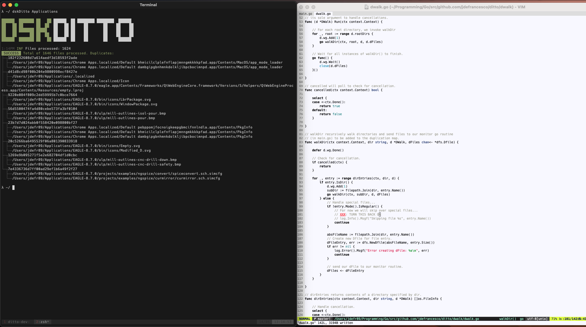
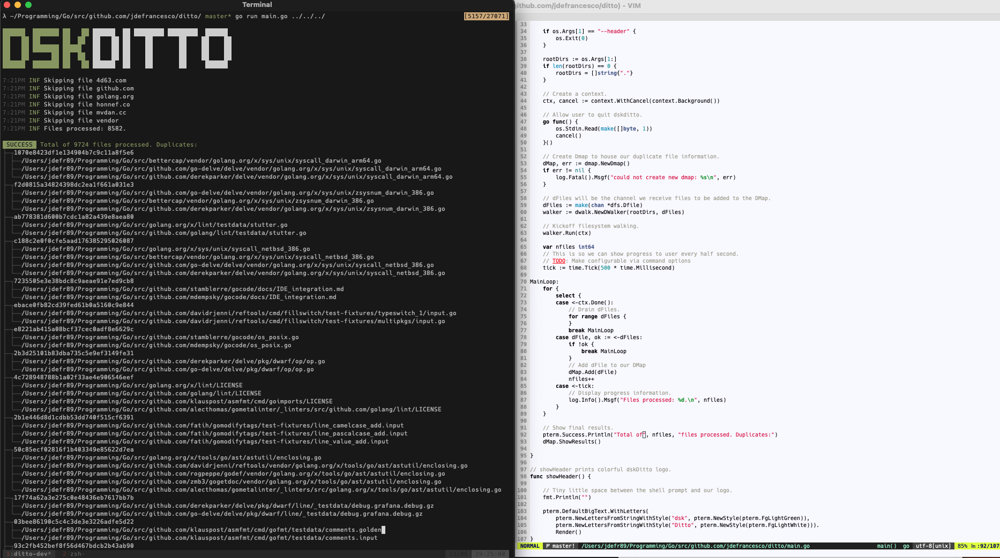

# dskDitto 

## About

DskDitto is a tiny utility written in Go that helps identify duplicate/useless files on your machine
in only a matter of seconds. It is highly concurrent, and efficient. The project is still in its infancy
so many features are still yet to be implemented. 

**WARNING:** Although in the future this tool will be cross-platform, I have only been testing/developing it on macOS.

## Screenshots





## Building

Running the following commands will create a new executable `dskDitto`.

```bash
$ git clone https://github.com/jdefrancesco/dskDitto && cd dskDitto
$ make
```

## Contributing

TODO

