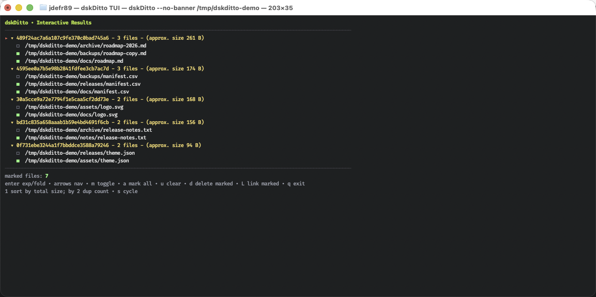
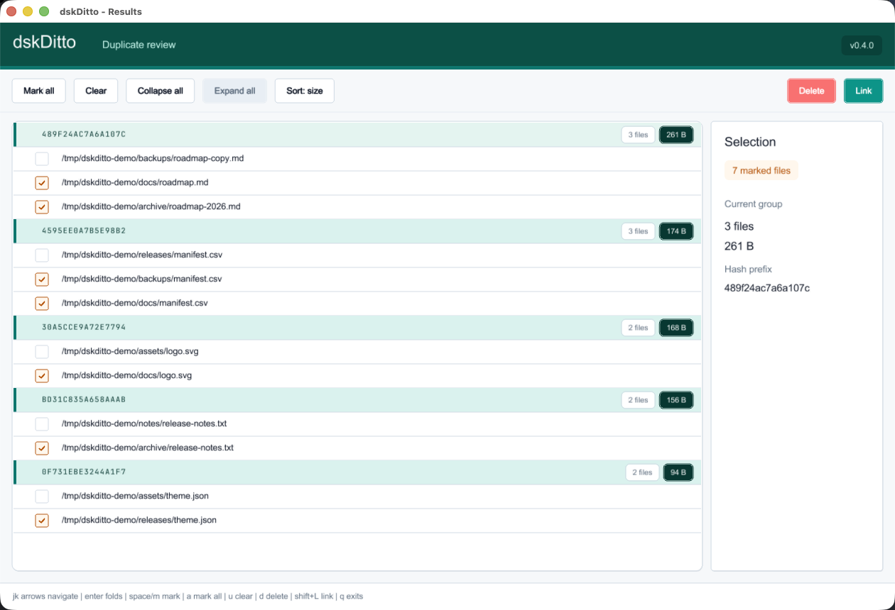

# dskDitto

[](https://pkg.go.dev/github.com/jdefrancesco/dskDitto)
[](https://goreportcard.com/report/github.com/jdefrancesco/dskDitto)
[](LICENSE)


`dskDitto` The ultra-fast, parallel duplicate-file detector with interactive menus that make clearing unnecessary duplicates hassle free!

## Features

- **Blazingly fast duplicate scanning** — Parallel processing finds duplicates across large disks instantly.
- **Interactive TUI by default** — Browse, compare, and manage duplicates with an intuitive terminal interface powered by Bubble Tea.
- **Optional GUI** — Use the experimental Raylib GUI for a graphical alternative to the TUI.
- **Safe deletion & symlink conversion** — Remove duplicates or replace them with symlinks, with confirmation dialogs to prevent accidents.
- **Smart single-file search** — Hash a specific file and instantly find all its duplicates across your filesystem.
- **Flexible hashing** — Choose between SHA-256 (default) or BLAKE3 for content verification.
- **Fine-grained filtering** — Skip files by size, depth, hidden files, symlinks, and virtual filesystems.
- **Export results** — Save findings to CSV, JSON, or plain text for reporting or automation.
- **Unix hard-link aware** — Treats hard-linked files intelligently to avoid false duplicates.

## Install

Install straight from source using Go 1.22+:

```bash
go install github.com/jdefrancesco/dskDitto/cmd/dskDitto@latest
```

This drops the binary at `$(go env GOPATH)/bin/dskDitto` (or `~/go/bin` by default).

## Usage

```bash
dskDitto [options] PATH ...
```

Common flags:

| Flag                 | Description                                                                                         |
| -------------------- | --------------------------------------------------------------------------------------------------- |
| `--version`          | Print the current version and exit                                                                  |
| `--no-banner`        | Skip the startup banner                                                                             |
| `--gui`              | Review results in the experimental Raylib GUI instead of the default TUI                            |
| `--profile <file>`   | Write a CPU profile to the given file                                                               |
| `--time-only`        | Exit immediately after the scan, printing only the elapsed time                                     |
| `--min-size <bytes>` | Ignore files smaller than the provided size                                                         |
| `--max-size <bytes>` | Skip files larger than the provided size (default 4 GiB)                                            |
| `--hidden`           | Include dot files and dot-directories                                                               |
| `--exclude <path>`   | Exclude a path from scanning (repeatable; excludes descendants)                                     |
| `--no-symlinks`      | Skip symbolic links                                                                                 |
| `--empty`            | Include zero-byte files                                                                             |
| `--include-vfs`      | Include virtual filesystem directories such as `/proc` or `/dev`                                    |
| `--current`          | Restrict the scan to only the specified paths (no recursion)                                        |
| `--depth <levels>`   | Limit recursion to `<levels>` directories below the starting paths                                  |
| `--dups <count>`     | Only show groups that contain at least `<count>` files                                              |
| `--text`, `--bullet` | Render duplicates without launching the TUI                                                         |
| `--remove <keep>`    | Operate on duplicates, keeping the first `<keep>` entries per group                                 |
| `--link`             | With `--remove`, convert extra duplicates to symlinks instead of deleting them                      |
| `--file <path>`      | Only report duplicates of the given file                                                            |
| `--hash <algo>`      | Select hash algorithm: `sha256` (default) or `blake3`                                               |
| `--csv-out <file>`   | Write duplicate groups to CSV                                                                       |
| `--json-out <file>`  | Write duplicate groups to JSON                                                                      |
| `--fs-detect <path>` | Print the filesystem type that contains `<path>`                                                    |
| `--color-safe`       | Use a high-compatibility TUI theme that avoids custom colors (best for problematic terminal themes) |

Press `Ctrl+C` at any time to abort a scan. When duplicates are removed or converted, a confirmation dialog prevents accidental mass changes.

### Duplicate removal and symlink conversion

`dskDitto` never deletes or rewrites anything unless you explicitly ask it to with `--remove`.

- **Dry / interactive modes:** by default (or with `--text` / `--bullet`) the tool only reports duplicates.
- **Delete extras:** use `--remove <keep>` to delete all but `<keep>` files in each duplicate group.
- **Convert extras to symlinks:** combine `--remove <keep> --link` to replace extra duplicates with symlinks pointing at one kept file per group.

In the TUI you can also convert the currently marked files into symlinks: mark the duplicates you want to replace, then press `L` and enter the confirmation code. Each group’s symlinks will point at one unmarked file in that group.

On Unix-like systems, multiple hard links to the same underlying file are treated as a single entry during scanning: `dskDitto` hashes the content once and does not report those hard-link paths as separate space-wasting duplicates.

When using `--link`, the on-disk layout after the operation looks like this for a group of 3 identical files and `--remove 1 --link`:

```text
/path/to/keep/file.txt      # original file kept
/path/to/dup/file-copy.txt  -> /path/to/keep/file.txt  (symlink)
/another/location/file.txt  -> /path/to/keep/file.txt  (symlink)
```

In the TUI, files that are symlinks are annotated with a `[symlink]` suffix so you can see which entries were converted.

### Single-file duplicate search

Use `--file /path/to/original.ext` to hash a specific file first, then scan the provided directories for other files with identical content. If no duplicates are found in those directories, `dskDitto` exits cleanly; otherwise, all reporting/removal/export modes are limited to that single duplicate group (with the original file listed first).

### Hash algorithms

By default, `dskDitto` uses SHA-256 for content hashing:

- **SHA-256 (`--hash sha256`)**: conservative, widely-supported choice with strong collision guarantees.
- **BLAKE3 (`--hash blake3`)**: Under many circumstances this is significantly faster on modern CPUs. However, on macOS `SHA256` is fine tuned and out performs `BLAKE3` most of the time. Thus, we leave `SHA-256` as the default for now.

## Examples

Scan your home directory and interactively review duplicates:

```bash
dskDitto $HOME
```

Use the experimental Raylib windowed UI:

```bash
dskDitto --gui $HOME
```

Exclude a directory (or file) from scanning:

```bash
dskDitto --exclude $HOME/Library/Caches $HOME
```

Exclude multiple paths in one scan (repeat `--exclude`):

```bash
dskDitto \
  --exclude $HOME/Library/Caches \
  --exclude $HOME/.cache \
  --exclude $HOME/Downloads \
  $HOME
```

List duplicates for scripting or grepping, without launching the TUI:

```bash
dskDitto --text ~/Pictures ~/Movies | grep "\.jpg$"
```

Find and safely delete duplicates larger than 100 MiB, keeping one copy per group:

```bash
dskDitto --min-size 100MiB --remove 1 /mnt/big-disk
```

Shrink a media library by converting duplicates into symlinks instead of deleting them:

```bash
dskDitto --remove 1 --link ~/Media
```

Export duplicate information to CSV or JSON for offline analysis:

```bash
dskDitto --csv-out dupes.csv  ~/Photos
dskDitto --json-out dupes.json ~/Projects
```

### Recipes

- **Clean a downloads folder but keep one copy of each installer:**

  ```bash
  dskDitto --min-size 10MiB --remove 1 ~/Downloads
  ```

- **Deduplicate a photo drive while preserving directory layout with symlinks:**

  ```bash
  dskDitto --remove 1 --link /Volumes/photo-archive
  ```

- **Hunt for big redundant media files only:**

  ```bash
  dskDitto --min-size 500MiB --text ~/Movies ~/TV
  ```

- **Use BLAKE3**

  > _NOTE:_ On _macOS_, `Blake3` will actually perform **worse** than `SHA256` hence, we leave it as default for time being. `Blake3's` implementation may improve in the future, possibly out performing `SHA256`.

  ```bash
  dskDitto --hash blake3 --min-size 10MiB --text /mnt/big-disk
  ```

- **Feed duplicate groups into another tool via CSV:**

  ```bash
  dskDitto --csv-out dupes.csv /data
  ```

## Result Display Menus



[Bubble Tea](https://github.com/charmbracelet/bubbletea) was used for TUI

## GUI Result Display



GUI built with [Raylib](https://github.com/raysan5/raylib)

## Benchmarks

## Build From Source (Development)

Ensure you have

- `go` (1.22+)
- `gosec` (install via `go install github.com/securego/gosec/v2/cmd/gosec@latest`)

```bash
git clone https://github.com/jdefrancesco/dskDitto
cd dskDitto
make
```

The resulting binary lives in `bin/dskDitto`. Add it to your `$PATH` or run it from the repo root.
To explicitly build and smoke-run the `Raylib` GUI path:

```bash
make build-gui
make run-gui GUI_PATH=$HOME
```

Install the built binary somewhere on your path (defaults to `/usr/local/bin`) with:

```bash
sudo make install PREFIX=/usr/local/bin
```

Override `PREFIX` (for example `make install PREFIX=$HOME/.local/bin`) if you prefer a user-local install and want to skip `sudo`.

```bash
make debug         # Create development build
make build-gui     # Build a GUI-capable binary
make run-gui       # Build and launch the Raylib GUI against GUI_PATH (default ".")
make release-check # Print the tag/push/public-install release checklist
make release-install-check # Verify what go install ...@latest currently installs
make test          # go test ./...
make bench         # run benchmarks (adds -benchmem)
make bench-profile # capture cpu.prof and mem.prof into the repo root
make pprof-web     # launch go tool pprof with HTTP UI for the latest profile
```

## Architecture

Coming soon.

## Configuration

- **Log level:** set `DSKDITTO_LOG_LEVEL` to `debug`, `info`, `warn`, etc.
- **Default options:** wrap `dskDitto` in a shell alias or script with your favorite defaults.
- **Profiling:** supply `--pprof host:port` to expose Go's `pprof` endpoints while the tool runs.

## Contributing

Issues and PRs are welcome. Open an issue if you have ideas for improvements, new output modes, or performance tweaks. I only
develop this in my spare time which is less and less these days. New contributors are definitely something the project needs.

## License

This project is released under the Apache license. See [`LICENSE`](LICENSE) for details.
