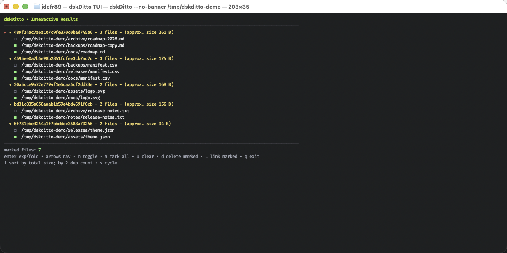
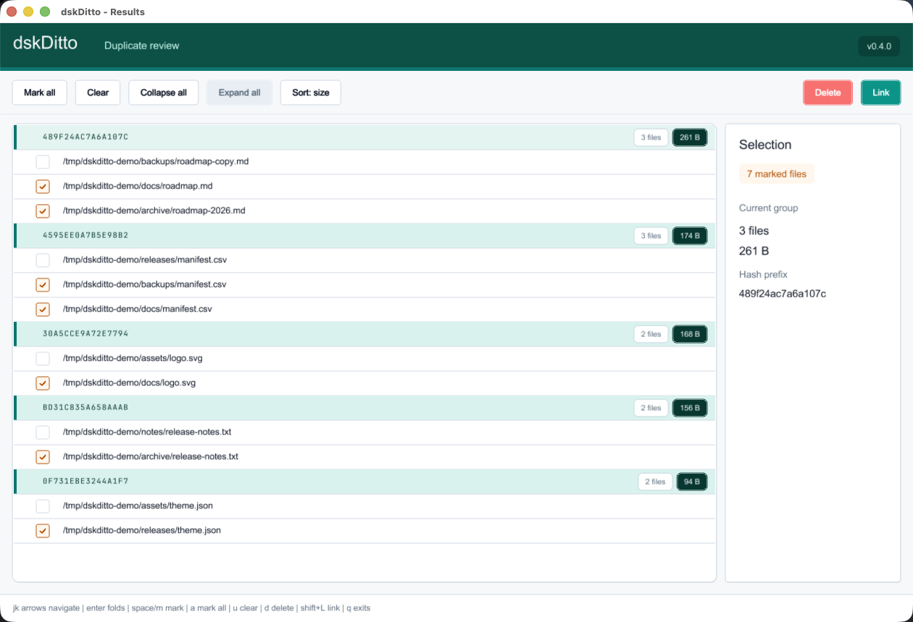

# dskDitto

[](https://pkg.go.dev/github.com/jdefrancesco/dskDitto)
[](https://goreportcard.com/report/github.com/jdefrancesco/dskDitto)
[](LICENSE)


`dskDitto` The ultra-fast, parallel duplicate-file detector with interactive menus that make clearing unnecessary duplicates hassle free!

## Features

- **Blazingly fast duplicate scanning** — Parallel processing finds duplicates across large disks instantly.
- **Interactive TUI by default** — Browse, compare, and manage duplicates with an intuitive terminal interface powered by Bubble Tea.
- **Optional GUI** — Use the experimental Raylib GUI for a graphical alternative to the TUI.
- **Safe deletion, symlink, and reflink conversion** — Remove duplicates, replace them with symlinks, or (on reflink-capable filesystems) convert them into space-saving copy-on-write clones, with confirmation dialogs to prevent accidents.
- **Smart single-file search** — Hash a specific file and instantly find all its duplicates across your filesystem.
- **Flexible hashing** — Choose between SHA-256 (default) or BLAKE3 for content verification.
- **Fine-grained filtering** — Skip files by size, depth, hidden files, symlinks, virtual filesystems, and filesystem boundaries.
- **Export results** — Save findings to CSV, JSON, or plain text for reporting or automation.
- **Unix hard-link aware** — Treats hard-linked files intelligently to avoid false duplicates.

## Install

Install straight from source using Go 1.22+:

```bash
go install -ldflags="-s -w" github.com/jdefrancesco/dskDitto/cmd/dskDitto@latest
```

This drops the CLI/TUI binary at `$(go env GOPATH)/bin/dskDitto` (or `~/go/bin` by default). The default install does not build the optional Raylib GUI. `-ldflags="-s -w"` strips debug symbols, shrinking the binary by roughly a third; drop it if you want a debuggable/profilable build instead.

To install a GUI-capable binary, make sure Raylib and CGo are available, then build with the `gui` tag:

```bash
go install -tags gui -ldflags="-s -w" github.com/jdefrancesco/dskDitto/cmd/dskDitto@latest
```

> **Note:** `go install ...@latest` always compiles from source on your machine, so `-ldflags` has to be passed on the command you run — there's no way for the module to bake that in for you.

## Usage

```bash
dskDitto [options] PATH ...
```

Run `dskDitto --help` for the full, categorized reference (General, Filtering & Scanning, Search Scope, Fuzzy Matching, Duplicate Actions, Output & Export, Backup & Restore); it's colorized by default and falls back to plain text with `--color-safe` or when output isn't a terminal. Common flags, most with a single-letter shorthand:

| Flag                      | Short | Description                                                                                         |
| ------------------------- | ----- | ---------------------------------------------------------------------------------------------------- |
| `--version`               | `-v`  | Print the current version and exit                                                                  |
| `--no-banner`             |       | Skip the startup banner                                                                             |
| `--gui`                   | `-g`  | Review results in the experimental Raylib GUI instead of the default TUI; requires a GUI build      |
| `--profile <file>`        |       | Write a CPU profile to the given file                                                               |
| `--time-only`             |       | Exit immediately after the scan, printing only the elapsed time                                     |
| `--min-size <bytes>`      |       | Ignore files smaller than the provided size                                                         |
| `--max-size <bytes>`      |       | Skip files larger than the provided size (default 4 GiB; use `0` for no limit)                      |
| `--all-sizes`             |       | Scan files of any size; clearer equivalent to `--max-size 0`                                        |
| `--hidden`                |       | Include dot files and dot-directories                                                               |
| `--exclude <path>`        | `-x`  | Exclude a path from scanning (repeatable; excludes descendants)                                     |
| `--no-symlinks`           |       | Skip symbolic links                                                                                 |
| `--empty`                 |       | Include zero-byte files                                                                             |
| `--include-vfs`           |       | Include virtual filesystem directories such as `/proc` or `/dev`                                    |
| `--one-file-system`       |       | Do not descend into directories on a different filesystem device; `--xdev` is a long alias          |
| `--dir-concurrency <int>` |       | Limit concurrent directory reads; values `<= 0` use automatic tuning                                |
| `--no-cache`              |       | On supported platforms, ask the OS not to populate the filesystem cache while hashing               |
| `--current`               |       | Restrict the scan to only the specified paths (no recursion)                                        |
| `--depth <levels>`        | `-d`  | Limit recursion to `<levels>` directories below the starting paths                                  |
| `--dups <count>`          |       | Only show groups that contain at least `<count>` files                                              |
| `--text`, `--bullet`      | `-t`, `-b` | Render duplicates without launching the TUI                                                    |
| `--remove <keep>`         | `-r`  | Operate on duplicates, keeping the first `<keep>` entries per group                                 |
| `--link`                  | `-l`  | With `--remove`, convert extra duplicates to symlinks instead of deleting them                      |
| `--reflink`               | `-R`  | With `--remove`, convert extra duplicates to reflinks (copy-on-write clones) instead of deleting them |
| `--file <path>`           | `-f`  | Only report duplicates of the given file; with `--name-only`, match by that file's exact name       |
| `--name-only`             |       | Shallow mode: group files by exact file name, ignoring content and size                             |
| `--file-shallow <path>`   |       | Shallow mode: only report files with the same exact name as `<path>`                                |
| `--fuzzy`                 | `-F`  | Content-based near-duplicate mode (file similarity, not filename similarity)                         |
| `--fuzzy-threshold <pct>` |       | Minimum similarity percentage in fuzzy mode (default `75`)                                          |
| `--fuzzy-same-ext`        |       | In fuzzy mode, only compare files that share the same extension                                      |
| `--hash <algo>`           | `-H`  | Select hash algorithm: `sha256` (default) or `blake3`                                               |
| `--csv-out <file>`        |       | Write duplicate groups to CSV                                                                       |
| `--json-out <file>`       |       | Write duplicate groups to JSON                                                                      |
| `--fs-detect <path>`      |       | Print the filesystem type that contains `<path>`                                                    |
| `--color-safe`            |       | Use a high-compatibility theme (TUI and `--help`) that avoids custom colors                          |
| `--no-confirm`            | `-y`  | Skip interactive confirmation codes for TUI/GUI delete, link, and reflink actions                    |
| `--dry-run`               | `-n`  | With `--restore`, print actions without writing files                                               |

Short and long forms are interchangeable and write to the same option, e.g. `-r 1 -R` is identical to `--remove 1 --reflink`.

Press `Ctrl+C` at any time to abort a scan. When duplicates are removed or converted through the TUI or GUI, a confirmation dialog prevents accidental mass changes unless `--no-confirm` is set.

### Duplicate removal, symlink, and reflink conversion

`dskDitto` never deletes or rewrites anything unless you explicitly ask it to with `--remove`.

- **Dry / interactive modes:** by default (or with `--text` / `--bullet`) the tool only reports duplicates.
- **Delete extras:** use `--remove <keep>` to delete all but `<keep>` files in each duplicate group.
- **Convert extras to symlinks:** combine `--remove <keep> --link` to replace extra duplicates with symlinks pointing at one kept file per group.
- **Convert extras to reflinks:** combine `--remove <keep> --reflink` to replace extra duplicates with copy-on-write clones of one kept file per group. `--link` and `--reflink` are mutually exclusive.

In the TUI you can also convert the currently marked files into symlinks or reflinks: mark the duplicates you want to replace, then press `L` (symlink) or `R` (reflink) and enter the confirmation code. Each group's replacements point at (or clone from) one unmarked file in that group. Power users can pass `--no-confirm` to skip the confirmation code in the TUI and GUI.

On Unix-like systems, multiple hard links to the same underlying file are treated as a single entry during scanning: `dskDitto` hashes the content once and does not report those hard-link paths as separate space-wasting duplicates.

When using `--link`, the on-disk layout after the operation looks like this for a group of 3 identical files and `--remove 1 --link`:

```text
/path/to/keep/file.txt      # original file kept
/path/to/dup/file-copy.txt  -> /path/to/keep/file.txt  (symlink)
/another/location/file.txt  -> /path/to/keep/file.txt  (symlink)
```

In the TUI, files that are symlinks are annotated with a `[symlink]` suffix so you can see which entries were converted.

#### Reflink (copy-on-write clone) conversion

Unlike a symlink, a reflink stays a real, independent file — the same size and inode-visible content as the original — but shares its underlying disk blocks with the kept file until either copy is modified, at which point the filesystem transparently copies only the changed blocks. This means:

- Deleting or moving the original kept file does not break the reflinked duplicate (no dangling link, unlike a symlink).
- Editing either the kept file or a reflinked duplicate does not affect the other; the shared blocks are copied on first write.
- Disk usage drops immediately after conversion, just like symlinking, but each path remains a fully independent file to every other tool that touches it.

Reflink cloning requires a copy-on-write-capable filesystem: **APFS** (macOS, via `clonefile(2)`) or **Btrfs**/**XFS with `reflink=1`** (Linux, via the `FICLONE` ioctl). It is not supported on ext4, FAT/exFAT, NTFS, or when the kept file and duplicate live on different filesystems/volumes. If cloning isn't possible for a given file, `dskDitto` reports it as an error for that file and leaves it untouched rather than deleting it — reflink conversion never removes a duplicate it failed to clone.

When using `--reflink`, the on-disk layout after the operation looks like this for a group of 3 identical files and `--remove 1 --reflink`:

```text
/path/to/keep/file.txt      # original file kept
/path/to/dup/file-copy.txt  # independent file, COW-cloned from file.txt
/another/location/file.txt  # independent file, COW-cloned from file.txt
```

In the TUI, converted files are marked with a `REFLINK` status tag rather than the `[symlink]` annotation, since they remain regular files on disk.

### Single-file duplicate search

Use `--file /path/to/original.ext` to hash a specific file first, then scan the provided directories for other files with identical content. If no duplicates are found in those directories, `dskDitto` exits cleanly; otherwise, all reporting/removal/export modes are limited to that single duplicate group (with the original file listed first).

### Shallow filename duplicate search

Use `--name-only` to group files by exact final filename without hashing file contents. For example, `dir1/text1` and `dir2/text1` are considered duplicates even when their contents differ. Combine `--name-only --file /path/to/text1`, or use `--file-shallow /path/to/text1`, to limit shallow results to one exact filename. When the shallow target is a dotfile, dskDitto automatically includes hidden files and directories for that scan.

Restore backups are not supported for shallow filename matches because same-name files may contain different data. If `--backup` is combined with `--name-only` or `--file-shallow`, `dskDitto` prints a warning and exits before scanning or changing files.

### Fuzzy content matching (near duplicates)

Use `--fuzzy` to find files with similar content even when they are not byte-for-byte identical. This mode compares file content signatures only; it does not use filename similarity.

By default, fuzzy mode returns groups at `>=75%` similarity:

```bash
dskDitto --fuzzy ~/Downloads
```

Tune the similarity cutoff when needed:

```bash
dskDitto --fuzzy --fuzzy-threshold 90 ~/Downloads
```

Restrict fuzzy comparisons to matching extensions:

```bash
dskDitto --fuzzy --fuzzy-same-ext ~/Downloads
```

`--fuzzy` results are review-only near matches. Automatic mutation flows (`--remove` / `--link`) are disabled in fuzzy mode.

### Hash algorithms

By default, `dskDitto` uses SHA-256 for content hashing:

- **SHA-256 (`--hash sha256`)**: conservative, widely-supported choice with strong collision guarantees.
- **BLAKE3 (`--hash blake3`)**: Under many circumstances this is significantly faster on modern CPUs. However, on macOS `SHA256` is fine tuned and out performs `BLAKE3` most of the time. Thus, we leave `SHA-256` as the default for now.

## Examples

Scan your home directory and interactively review duplicates:

```bash
dskDitto $HOME
```

Use the experimental Raylib windowed UI:

```bash
dskDitto --gui $HOME
```

The default install is CLI/TUI-only. If `--gui` reports that GUI support was not built in, reinstall with `go install -tags gui github.com/jdefrancesco/dskDitto/cmd/dskDitto@latest`.

Exclude a directory (or file) from scanning:

```bash
dskDitto --exclude $HOME/Library/Caches $HOME
```

Exclude multiple paths in one scan (repeat `--exclude`):

```bash
dskDitto \
  --exclude $HOME/Library/Caches \
  --exclude $HOME/.cache \
  --exclude $HOME/Downloads \
  $HOME
```

Stay on the starting filesystem, like `find -xdev` or `ncdu -x`:

```bash
dskDitto --one-file-system /
dskDitto --xdev $HOME
```

List duplicates for scripting or grepping, without launching the TUI:

```bash
dskDitto --text ~/Pictures ~/Movies | grep "\.jpg$"
```

Find files that share the same exact filename, ignoring contents:

```bash
dskDitto --name-only --text ~/Downloads ~/Documents
```

Find and safely delete duplicates larger than 100 MiB, keeping one copy per group:

```bash
dskDitto --min-size 100MiB --remove 1 /mnt/big-disk
```

Shrink a media library by converting duplicates into symlinks instead of deleting them:

```bash
dskDitto --remove 1 --link ~/Media
```

Shrink a media library on an APFS/Btrfs/XFS volume by converting duplicates into copy-on-write reflinks, keeping each file independently addressable:

```bash
dskDitto --remove 1 --reflink ~/Media
```

Export duplicate information to CSV or JSON for offline analysis:

```bash
dskDitto --csv-out dupes.csv  ~/Photos
dskDitto --json-out dupes.json ~/Projects
```

### Recipes

- **Clean a downloads folder but keep one copy of each installer:**

  ```bash
  dskDitto --min-size 10MiB --remove 1 ~/Downloads
  ```

- **Deduplicate a photo drive while preserving directory layout with symlinks:**

  ```bash
  dskDitto --remove 1 --link /Volumes/photo-archive
  ```

- **Deduplicate a photo drive on APFS/Btrfs/XFS while keeping each file independently addressable:**

  ```bash
  dskDitto --remove 1 --reflink /Volumes/photo-archive
  ```

- **Hunt for big redundant media files only:**

  ```bash
  dskDitto --min-size 500MiB --text ~/Movies ~/TV
  ```

- **Use BLAKE3**

  > _NOTE:_ On _macOS_, `Blake3` will actually perform **worse** than `SHA256` hence, we leave it as default for time being. `Blake3's` implementation may improve in the future, possibly out performing `SHA256`.

  ```bash
  dskDitto --hash blake3 --min-size 10MiB --text /mnt/big-disk
  ```

- **Feed duplicate groups into another tool via CSV:**

  ```bash
  dskDitto --csv-out dupes.csv /data
  ```

## Result Display Menus



[Bubble Tea](https://github.com/charmbracelet/bubbletea) was used for TUI

## GUI Result Display



GUI built with [Raylib](https://github.com/raysan5/raylib)

## Benchmarks

Benchmark directory traversal on your machine before choosing a fixed concurrency value. On fast APFS SSDs, the best range is usually workload-dependent:

```bash
go build -o dskDitto ./cmd/dskDitto
for w in 16 24 32 48 64 96 128; do
  /usr/bin/time -p ./dskDitto --time-only --dir-concurrency "$w" ~
done
```

Use `/usr/bin/time -l ./dskDitto --time-only ~` for a more detailed macOS run. `--no-cache` is also benchmark-only by default; test it with the same workload before keeping it in your normal command.

## Build From Source (Development)

Ensure you have

- `go` (1.22+)
- `gosec` (install via `go install github.com/securego/gosec/v2/cmd/gosec@latest`)

```bash
git clone https://github.com/jdefrancesco/dskDitto
cd dskDitto
make
```

The resulting binary lives in `bin/dskDitto`. Add it to your `$PATH` or run it from the repo root.
The default `make` path builds the CLI/TUI binary. To explicitly build and smoke-run the `Raylib` GUI path, make sure Raylib and CGo are available, then run:

```bash
make build-gui
make run-gui GUI_PATH=$HOME
```

Install the built binary somewhere on your path (defaults to `/usr/local/bin`) with:

```bash
sudo make install PREFIX=/usr/local/bin
```

Override `PREFIX` (for example `make install PREFIX=$HOME/.local/bin`) if you prefer a user-local install and want to skip `sudo`.

```bash
make debug         # Create development build
make build-gui     # Build a GUI-capable binary with -tags gui
make run-gui       # Build and launch the Raylib GUI against GUI_PATH (default ".")
make release-check # Print the tag/push/public-install release checklist
make release-install-check # Verify what go install ...@latest currently installs
make test          # go test ./...
make bench         # run benchmarks (adds -benchmem)
make bench-profile # capture cpu.prof and mem.prof into the repo root
make pprof-web     # launch go tool pprof with HTTP UI for the latest profile
```

## Architecture

See [`DittoDoc`](DittoDoc.md)

## Configuration

- **Log level:** set `DSKDITTO_LOG_LEVEL` to `debug`, `info`, `warn`, etc.
- **Default options:** wrap `dskDitto` in a shell alias or script with your favorite defaults.
- **Profiling:** supply `--pprof host:port` to expose Go's `pprof` endpoints while the tool runs.

## Contributing

Issues and PRs are welcome. Open an issue if you have ideas for improvements, new output modes, or performance tweaks. I only
develop this in my spare time which is less and less these days. New contributors are definitely something the project needs.

## License

This project is released under the Apache license. See [`LICENSE`](LICENSE) for details.
