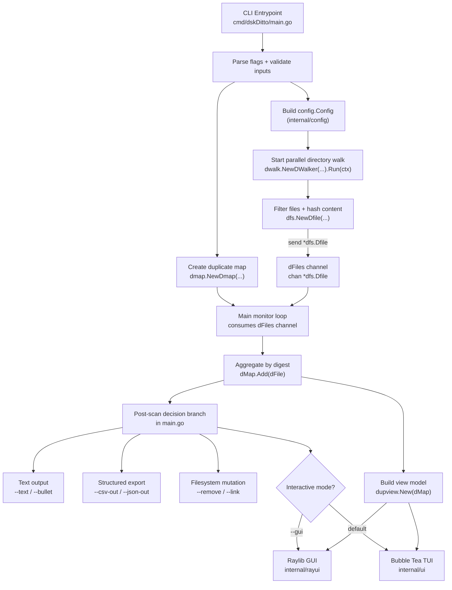

# DittoDoc — dskDitto Internals & Design Decisions

This document explains how dskDitto works under the hood, why certain algorithmic and
architectural choices were made, and what the key constants and tuneable parameters mean.
It is intended for contributors and anyone who wants to understand the codebase deeply.

---

## Table of Contents

1. [High-Level Pipeline](#high-level-pipeline)
2. [Phase 0 — Startup & Validation](#phase-0--startup--validation)
3. [Phase 1 — Parallel Directory Walk (dwalk)](#phase-1--parallel-directory-walk-dwalk)
4. [Phase 2 — Size Grouping & Candidate Filtering](#phase-2--size-grouping--candidate-filtering)
5. [Phase 3 — Sample Hashing](#phase-3--sample-hashing)
6. [Phase 4 — Full Content Hashing (dfs)](#phase-4--full-content-hashing-dfs)
7. [The Duplicate Map (dmap)](#the-duplicate-map-dmap)
8. [Scan Modes](#scan-modes)
9. [Worker-Pool Tuning](#worker-pool-tuning)
10. [Manifest & Restore System](#manifest--restore-system)
11. [Output Layer — TUI, GUI, Text](#output-layer--tui-gui-text)
12. [Hash Algorithm Choice](#hash-algorithm-choice)
13. [Platform-Specific Code](#platform-specific-code)
14. [Key Dependencies](#key-dependencies)
15. [Tunable Constants Reference](#tunable-constants-reference)

---

## High-Level Pipeline

The normal (non-fuzzy, non-shallow) scan follows five sequential phases:

```
Directory Walk  →  Size Group  →  Sample Hash  →  Full Hash  →  Dmap / UI
```

Each phase filters the candidate set down so the most expensive operation (full
content hashing) is only performed on files that genuinely need it.

The fuzzy and shallow (name-only) modes branch off before the sample/full hash
phases and use their own grouping logic.

---

## Phase 0 — Startup & Validation

`cmd/dskDitto/main.go` is the sole entry point. It:

1. Parses CLI flags with the standard `flag` package.
2. Validates mode compatibility (e.g., `--fuzzy` is incompatible with `--remove`
   and `--link`; `--name-only` is incompatible with `--backup`).
3. Parses human-readable size strings (`--min-size`, `--max-size`) via
   `pkg/utils.ParseSize`.
4. Constructs a `config.Config` value that is passed down to the walker.
5. Registers a `signal.Notify` handler for `SIGINT`/`SIGTERM` so a
   `context.CancelFunc` can cleanly drain all goroutines when the user presses
   Ctrl+C.

**Why validate early?** Detecting incompatible flags before any I/O takes place
gives users a fast, clear error message rather than a confusing failure mid-scan.

---

## Phase 1 — Parallel Directory Walk (dwalk)

`internal/dwalk` implements a concurrent recursive walker. The public surface is
`DWalker.Run(ctx)`, which sends `FileCandidate{Path, Size}` values on a channel
for the main loop to consume.

### Concurrency model

```
DWalker.Run()
  ├─ goroutine per directory
  │    └─ sem.Acquire(1) ← weighted semaphore (golang.org/x/sync)
  │    └─ os.ReadDir(path)
  │    └─ sem.Release(1)
  │    └─ recurse into subdirs (new goroutine each)
  └─ sync.WaitGroup to know when all dirs are done
```

The semaphore capacity is `min(GOMAXPROCS × dirWalkProcMultiplier, MaxWorkerCount)`
which defaults to `min(4 × GOMAXPROCS, 128)`. This matches the level of I/O
parallelism that keeps directory-read syscalls in-flight without saturating the
scheduler.

### Hard-link deduplication

On Unix, two directory entries can point to the same inode (hard links). Without
deduplication the same file content would be hashed twice and reported as a
"duplicate of itself." `dwalk` tracks every `(dev, inode)` pair in a
`map[fileIdentity]struct{}` protected by a mutex. The first path seen for an
inode is forwarded as a candidate; subsequent hard-link paths are silently
dropped.

`internal/dwalk/inode_unix.go` extracts `dev` and `ino` from `syscall.Stat_t`.
`inode_other.go` provides a no-op fallback for non-Unix platforms (Windows).

### Filtering

The walker skips a candidate if any of the following applies:

- File size is below `--min-size` or above `--max-size` (default 4 GiB).
- The entry is a symlink and `--no-symlinks` is set.
- The file is a zero-byte file and `--empty` is not set.
- The path starts with a VFS prefix (`/proc`, `/sys`, `/dev`, …) and
  `--include-vfs` is not set.
- The path matches a prefix supplied via `--exclude`.
- Recursion depth exceeds `--depth`.

## Phase 2 — Size Grouping & Candidate Filtering

After the walk, all `FileCandidate` values are accumulated and grouped by exact
byte size. Any size bucket with fewer than `--dups` entries (default 2) is
immediately discarded.

**Why group by size first?** Two files with different sizes cannot be identical.
Grouping by size eliminates the majority of candidates with zero I/O. On a
typical home directory this single step discards 90–99 % of files before a single
byte is read from disk for hashing.

The size groups are held in `map[int64][]FileCandidate`. Entries in single-file
buckets are counted as "skipped by unique size" in debug logs.


## Phase 3 — Sample Hashing

For each surviving candidate, `dfs.HashFileSampleWithOptions` reads the first
**4 KiB** of the file (constant `sampleChunkSize`) and produces a digest. If the
file is ≤ 4 KiB the sample covers the whole file; `CoversWholeFile` is set to
`true` and the candidate is promoted directly to the duplicate map without a
second read.

Candidates are processed by a worker pool:

```text
sampleJobs  chan FileCandidate  →  [workers]  →  sampledFileCh  chan sampledFile
```

Worker count = `BoundedWorkerCount(len(sampleList), sampleWorkerMultiplier)`,
where `sampleWorkerMultiplier = 4`.

Results are grouped by `(size, sampleDigest)`. Buckets with only one entry are
discarded — those files have unique first-4-KiB content and cannot be duplicates.

**Why 4 KiB?** 4 KiB is one typical filesystem block. A single `read(2)` call
suffices on most block sizes, making the operation extremely cheap. Empirically,
the vast majority of near-collisions (same size, different content) are
distinguishable from the first block alone.


## Phase 4 — Full Content Hashing (dfs)

The files that survived sample grouping are fully hashed. `dfs.Dfile` wraps the
result:

```go
type Dfile struct {
    fileName string     // absolute path
    fileSize int64
    algo     HashAlgorithm
    fileHash [32]byte   // SHA-256 or BLAKE3 digest
}
```

`hashFile()` uses two resources:

1. **File-descriptor semaphore** — channel of capacity `OpenFileDescLimMax = 2048`.
   Acquiring a slot before `os.Open` prevents EMFILE errors on scans of millions
   of files.
2. **`sync.Pool` of 1 MiB buffers** — `io.CopyBuffer` with a pooled buffer avoids
   allocating a new heap slice for every file. Under high concurrency the GC
   pressure from per-file allocations of this size would be significant.

Worker count = `BoundedWorkerCount(len(fullHashList), hashWorkerMultiplier)`,
where `hashWorkerMultiplier = 4`. Full hashing is I/O-bound, so a multiplier of
4× GOMAXPROCS keeps the storage device busy.

If `--no-cache` is set, `dfs` calls the platform-specific `setNoCacheFD` on the
open file descriptor before reading. On macOS this uses `fcntl(F_NOCACHE)` to
hint that the pages should not populate the page cache — useful when benchmarking
to get cold-cache timing, or when scanning a very large archive that would
otherwise evict hot data.

---

## The Duplicate Map (dmap)

`internal/dmap.Dmap` is the central output structure:

```go
type Dmap struct {
    filesMap      map[Digest][]string   // digest → list of paths
    matches       map[Digest]MatchInfo  // digest → how the group was matched
    minDuplicates uint
    fileCount     uint
}

type MatchInfo struct {
    Type MatchType   // "content", "name", or "fuzzy"
    Key  string      // hex digest, filename, or fuzzy group key
}
```

`Digest` is `[32]byte` — the raw hash output. Using a fixed-size array as a map
key is faster than a hex string because it avoids a heap allocation and allows
direct memory comparison.

`AddPath(digest, path)` appends to the slice for `digest`. Only digests whose
slice reaches `minDuplicates` length are ever exposed to the UI.

After scanning, `dmap` is converted to `dupview.Model` — a read-only,
UI-friendly list of groups sorted by group size descending — and handed to
whichever output mode was selected.


## Scan Modes

### Normal (content) mode

The default. Full content hash determines duplicates. All five phases run.

### Shallow / name-only mode (`--name-only`)

Files are grouped by their base filename only, without reading content. The walk
and size-grouping phases still run; sample and full hashing are skipped. Groups
are stored in `dmap` with `MatchType = MatchName`.

Because same-name files may differ in content, `--backup` is incompatible with
this mode (restoring a "canonical" copy could overwrite a legitimately different
file).

### Single-file mode (`--file <path>`)

The target file is hashed first. The directory scan then runs normally, but the
final duplicate map is filtered to keep only the group whose digest matches the
target. The target path is always listed first in that group.

In `--name-only` + `--file` mode, only files whose basename matches the target's
basename are included.

### Fuzzy / near-duplicate mode (`--fuzzy`)

`internal/fuzzy` implements content-similarity grouping using a simhash-style
fingerprint:

1. `SignatureFromFile` reads up to `DefaultMaxReadBytes = 256 KiB` of each file.
2. The content is split into overlapping word-level shingles and each shingle is
   hashed to build a bit-vector. A majority vote across shingles produces a
   compact 256-bit signature.
3. Signatures are compared pairwise. Two files whose signatures differ by fewer
   than `(1 - threshold/100) × 256` bits are grouped together.
4. A greedy graph-connected-components algorithm builds the final groups.

Worker count for signature computation is `min(GOMAXPROCS, sigWorkerCap)` where
`sigWorkerCap = 8`. Signature computation is CPU-bound, so a tight ceiling
prevents over-scheduling on high-core-count machines.

Files smaller than `DefaultFuzzyMinFileSize = 4 KiB` are excluded from fuzzy
candidates because tiny files produce unreliable signatures and rarely constitute
meaningful near-duplicates.

Fuzzy mode is **read-only** — `--remove` and `--link` are disabled because
near-duplicate files may legitimately differ in important ways.

---

## Worker-Pool Tuning

All worker pools share a common pattern in `pkg/utils.BoundedWorkerCount`:

```go
workers = min(GOMAXPROCS × multiplier, MaxWorkerCount)
workers = min(workers, totalWork)   // never spawn idle goroutines
```

| Pool | Multiplier | Cap | Why |
|---|---|---|---|
| Directory walk | `dirWalkProcMultiplier = 4` | `MaxWorkerCount = 128` | `ReadDir` is latency-bound; 4× keeps the syscall queue full |
| Sample hashing | `sampleWorkerMultiplier = 4` | `MaxWorkerCount = 128` | Tiny reads, mostly I/O latency |
| Full hashing | `hashWorkerMultiplier = 4` | `MaxWorkerCount = 128` | Large sequential reads, throughput-limited |
| Fuzzy signatures | 1× GOMAXPROCS | `sigWorkerCap = 8` | CPU-bound; more workers hurt via cache thrashing |

`MaxWorkerCount = 128` was chosen empirically. Beyond ~128 goroutines performing
concurrent file I/O the scheduler overhead and kernel lock contention in the VFS
layer dominate, and throughput plateaus or regresses. The constant is defined
once in `pkg/utils` so all call sites stay consistent.

---

## Manifest & Restore System

`internal/manifest` implements a backup/restore safety net. Before deleting or
symlinking files, dskDitto can write a JSONL manifest (one JSON object per line)
that records enough metadata to reverse the operation:

```json
{"version":1,"group_id":1,"hash_algo":"sha256","hash":"abc123...","size":4096,
 "canonical":"/keep/file.txt","restore_path":"/deleted/copy.txt",
 "mode":33188,"mtime_unix":1700000000,"mtime_nsec":0,"dev":16777220,"ino":12345}
```

Each `Entry` captures:

- `canonical` — the file that was kept.
- `restore_path` — the path that was removed/replaced.
- `mode`, `mtime_*`, `dev`, `ino` — Unix metadata for full fidelity restore
  (omitted on non-Unix).

**Why JSONL?** Line-delimited JSON is streamable: the writer appends one line at
a time without buffering the whole manifest, and a reader can process entries
individually without loading the entire file into memory. It is also trivially
inspectable with `grep`/`jq`.

The writer uses an atomic temp-file-then-rename pattern so a crash mid-write
never leaves a partially-written manifest at the intended path.

`RestoreOptions` supports `DryRun`, `Overwrite`, `VerifyHash`, and
`RestoreMTime`. When `VerifyHash` is set, the restore operation re-hashes the
canonical file and refuses to copy it if the digest no longer matches the
manifest, preventing silent data corruption.

---

## Output Layer — TUI, GUI, Text

After scanning, the populated `Dmap` is converted to a `dupview.Model` which is
the shared read-only view consumed by all output modes.

| Mode | Package | Trigger |
|---|---|---|
| Interactive TUI | `internal/ui` (Bubble Tea) | default |
| Experimental GUI | `internal/rayui` (Raylib) | `--gui` |
| Plain text list | `cmd/dskDitto/main.go` | `--text` / `--bullet` |
| CSV export | `internal/dmap/export.go` | `--csv-out` |
| JSON export | `internal/dmap/export.go` | `--json-out` |
| Non-interactive removal | `cmd/dskDitto/main.go` | `--remove` |

The TUI is built with [Bubble Tea](https://github.com/charmbracelet/bubbletea)
using an Elm-like message/update/view architecture. It renders a navigable list
of duplicate groups with per-file marking for selective deletion or symlinking.
The `--color-safe` flag switches to a theme that avoids 24-bit colour escapes for
terminals that mangle them.

The GUI is an experimental [Raylib](https://github.com/raysan5/raylib) window
(`--gui`) that presents the same data as the TUI but in a native windowed
renderer. It is opt-in because it requires CGo and the raylib system libraries at
build time.


## Hash Algorithm Choice

dskDitto supports two algorithms, selectable with `--hash`:

- **SHA-256** (default) — conservative, universally supported, hardware-accelerated
  on modern x86-64 (via SHA-NI extensions) and Apple Silicon (via dedicated crypto
  engines). On macOS the system crypto engine makes SHA-256 extremely competitive.
- **BLAKE3** — generally faster than SHA-256 on x86-64 CPUs without SHA-NI, and
  on some Linux workloads. On macOS, the system-tuned SHA-256 path typically
  outperforms BLAKE3, which is why SHA-256 remains the default.

Both algorithms produce 32-byte (256-bit) digests, which is why `Dfile.fileHash`
and `dmap.Digest` are both `[32]byte`.

**Collision safety:** SHA-256 and BLAKE3 both have collision resistance far beyond
what any practical duplicate-file workload could encounter. Using the raw digest
as a map key (rather than a truncated version) preserves that guarantee at zero
extra cost.


## Platform-Specific Code

| File | Platform | Purpose |
|---|---|---|
| `dwalk/inode_unix.go` | Unix | Extract `(dev, ino)` from `syscall.Stat_t` for hard-link dedup |
| `dwalk/inode_other.go` | Non-Unix | No-op identity; hard-link dedup disabled |
| `dfs/nocache_darwin.go` | macOS | `fcntl(F_NOCACHE)` — bypass page cache on open fd |
| `dfs/nocache_other.go` | Other | No-op; `--no-cache` silently ignored |
| `dfs/detectlinux.go` | Linux | Filesystem type detection via `statfs` |
| `dfs/detectmacos.go` | macOS | Filesystem type detection via `statfs` |
| `manifest/io_unix.go` | Unix | Preserve `mtime` and `mode` during restore |
| `manifest/metadata_unix.go` | Unix | Populate `dev`/`ino` in manifest entries |


## Key Dependencies

| Package | Purpose |
|---|---|
| `golang.org/x/sync` | `semaphore.Weighted` for bounded directory-read concurrency |
| `lukechampine.com/blake3` | Pure-Go BLAKE3 implementation |
| `github.com/charmbracelet/bubbletea` | Elm-style TUI framework |
| `github.com/charmbracelet/lipgloss` | Declarative terminal styling |
| `github.com/gen2brain/raylib-go/raylib` | CGo bindings for Raylib (GUI mode) |
| `github.com/pterm/pterm` | Progress spinners and formatted terminal output |
| `github.com/sirupsen/logrus` | Structured levelled logging (`DSKDITTO_LOG_LEVEL`) |
| `github.com/cloudfoundry/gosigar` | Cross-platform system/memory info |
| `golang.org/x/sys` | Low-level Unix syscall wrappers (`fcntl`, `statfs`, etc.) |

---
## Tunable Constants Reference

| Constant | Package | Value | Flag override | Notes |
|---|---|---|---|---|
| `MAX_FILE_SIZE` | `dwalk` | 4 GiB | `--max-size` | Files larger than this are skipped by the walker |
| `DEFAULT_DIR_CONCURRENCY` | `dwalk` | 50 | `--dir-concurrency` | Fallback when automatic tuning is not used |
| `dirWalkProcMultiplier` | `dwalk` | 4 | — | `ReadDir` goroutines = `4 × GOMAXPROCS` |
| `MaxWorkerCount` | `pkg/utils` | 128 | — | Hard ceiling for all goroutine pools |
| `sampleChunkSize` | `dfs` | 4 KiB | — | Bytes read during sample-hash phase |
| `OpenFileDescLimMax` | `dfs` | 2048 | — | Max concurrent open file descriptors |
| `hashWorkerMultiplier` | `cmd/dskDitto` | 4 | — | Full-hash goroutines = `4 × GOMAXPROCS` |
| `sampleWorkerMultiplier` | `cmd/dskDitto` | 4 | — | Sample-hash goroutines = `4 × GOMAXPROCS` |
| `sigWorkerCap` | `fuzzy` | 8 | — | Max fuzzy-signature goroutines |
| `DefaultMaxReadBytes` | `fuzzy` | 256 KiB | — | Max bytes consumed per file for similarity signature |
| `DefaultMinSimilarity` | `fuzzy` | 75 % | `--fuzzy-threshold` | Minimum similarity to form a near-duplicate group |
| `DefaultMaxFuzzyCandidates` | `fuzzy` | 10 000 | — | Candidate count ceiling before fuzzy grouping |
| `DefaultFuzzyMinFileSize` | `fuzzy` | 4 KiB | — | Files smaller than this are excluded from fuzzy mode |
| `mapInitSize` | `dmap` | 4096 | — | Pre-allocated capacity of the digest→paths map |

# dskDitto Runtime Architecture

This diagram captures the high-level runtime flow from CLI startup through duplicate detection and output modes.



## Legend

- `config.Config`: scan policy and filtering options derived from CLI flags.
- `chan *dfs.Dfile` (`dFiles`): streaming handoff of discovered + hashed files from walker goroutines to the main monitor loop.
- `dmap.Dmap`: in-memory digest-to-file-path index used to group duplicates and drive output operations.
- `dupview.Model`: shared UI-facing representation of duplicate groups used by both `internal/ui` (TUI) and `internal/rayui` (GUI).
