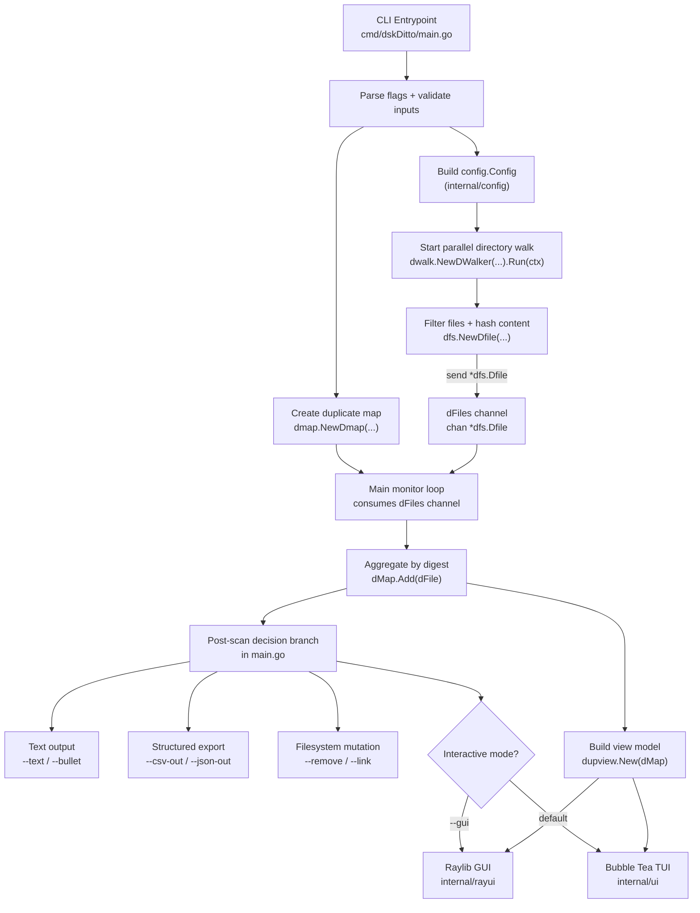

# dskDitto Runtime Architecture

This diagram captures the high-level runtime flow from CLI startup through duplicate detection and output modes.

## Legend

- `config.Config`: scan policy and filtering options derived from CLI flags.
- `chan *dfs.Dfile` (`dFiles`): streaming handoff of discovered + hashed files from walker goroutines to the main monitor loop.
- `dmap.Dmap`: in-memory digest-to-file-path index used to group duplicates and drive output operations.
- `dupview.Model`: shared UI-facing representation of duplicate groups used by both `internal/ui` (TUI) and `internal/rayui` (GUI).
